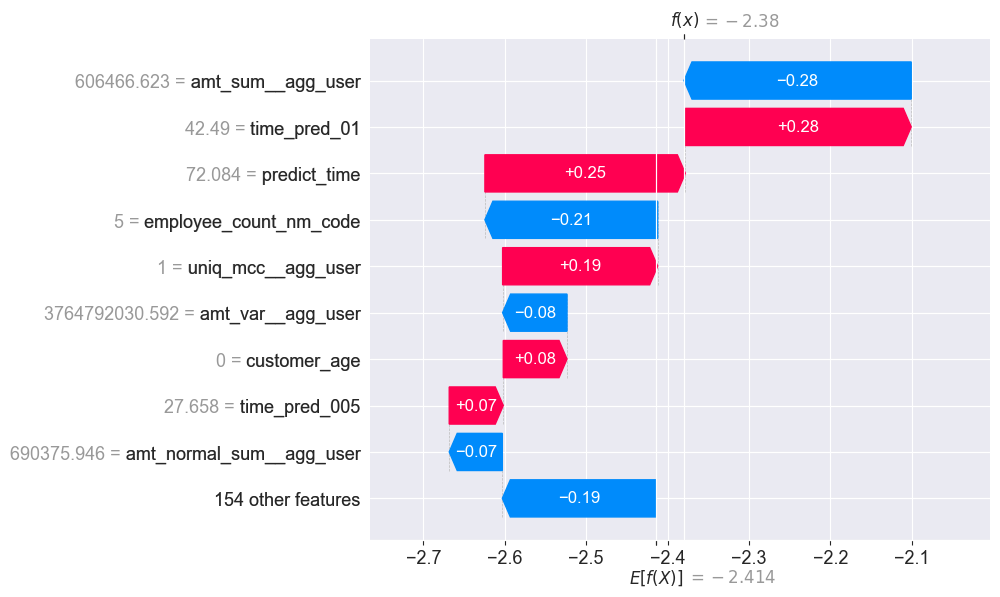

# Customer churn prediction
## Data Fusion Contest 2024
### Hosted at [ods.ai](https://ods.ai/competitions/data-fusion2024-churn)

## Target distribution and PSI across reports

## Kaplan-Meier survival curves

## Final best concordance index: 0.7903

## ROC-AUC

## SHAP user 538675

## SHAP user 112038

## SHAP overall

## Feature importance (166 features in total)

